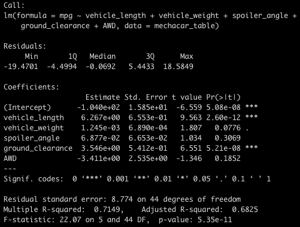
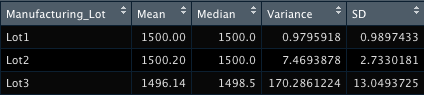
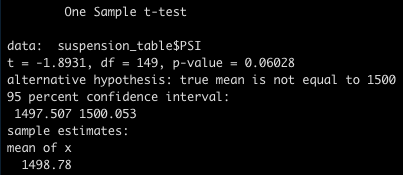
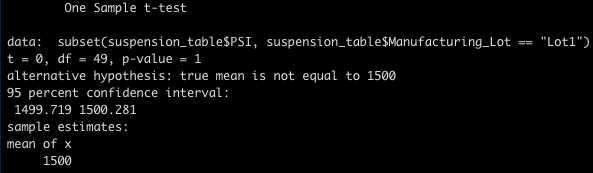
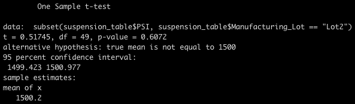
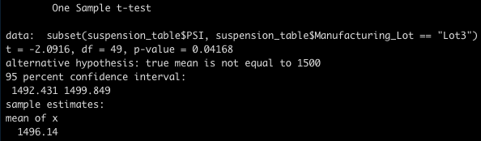

# MechaCar Statistical Analysis

## Linear Regression to Predict MPG

Production data of 50 MechaCar vehicles was used to create the pictured linear regression to create a model to predict MPG. The data contained the following variables:

- Vehicle Length
- Vehicle Weight
- Spoiler Angle
- Ground Clearance
- AWD

### Summary
- Vehicle length, ground clearance, and the intercept each made significant contributions to the variance of the mpg values.
- Because the p-value is reported as 5.35e-11 (well below a significance value of 0.05), the slope of the linear model is not zero.
- With an r^2 value of 0.71, the model predicts the mpg of the given data effectively.

## Summary Statistics on Suspension Coils

Data on MechaCar suspension coils was used to create the following statistical summaries:

Given that design specifications dictate variance must not exceed 100 PSI, manufacturing lot 3 is not meeting specifications, even though the lots as a whole are.

## T-Tests on Suspension Coils

The suspension coil data was then used to preform multiple t-tests.

### T-Test for All Suspension Coils

### T-Test for Each Manufacturing Lot

Both lots 1 and 2 are not significantly different from the population mean of 1500. Lot 3 is, with a p-value of 0.04.

## Study Design: MechCar vs Competition

To quantify how the MechaCar compares to its competition, fuel efficiency, among other key metrics, could be evaluated to find statistical differences between the MechaCar and other vehicles. In this analysis, the null hypothesis is that there is no statistically significant difference between the fuel efficiencies of the MechaCar and some other vehicle, and the alternative hypothesis is that the MechaCar tends to perform better or worse than some other vehicle. Since we are looking for statistical differences between two samples of numerical, continuous data, we should use a two-sample t-test. The test would simply need fuel efficiency data on the MechaCar, as well as on any competitor vehicles that are to be analyzed.
